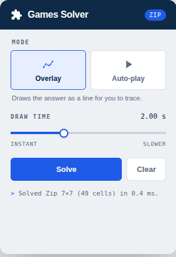
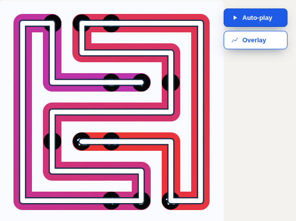
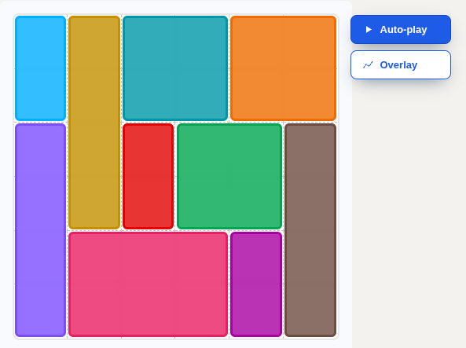

<div align="center">
  
  <h1>LinkedIn Games Solver</h1>
  <p>
    <b>A browser extension that solves LinkedIn's daily games.</b>
    <br />
    It reads the board off the page, finds the answer, and either draws it for you to trace or plays it on the board. 
    It ships with
    <a href="https://www.linkedin.com/games/zip/">Zip</a>
    and
    <a href="https://www.linkedin.com/games/patches/">Patches</a>, 
    and new games plug in as small self-contained modules.
  </p>
  <p>
    <code>Manifest V3</code> &middot; <code>Chrome / Brave</code> &middot;
    <code>No dependencies</code> &middot; <code>Runs fully offline</code>
  </p>
  
</div>

---

## Contents

- [Supported games](#supported-games)
- [Install](#install)
- [Usage](#usage)
- [Architecture](#architecture)
- [Adding a game](#adding-a-game)
- [Games](#games)
  - [Zip](#zip)
  - [Patches](#patches)
- [Project structure](#project-structure)
- [Development](#development)
- [Limitations](#limitations)
- [Privacy](#privacy)
- [Disclaimer](#disclaimer)
- [License](#license)

---

## Supported games

| Game                | Modes               |
|---------------------|---------------------|
| [Zip](#zip)         | Overlay + Auto-play |
| [Patches](#patches) | Overlay + Auto-play |

More games can be added with a small module (see [Adding a game](#adding-a-game)).

---

## Install

The extension isn't on any store; you load it unpacked.

1. Clone or download this repository.
2. Open `chrome://extensions` (or `brave://extensions`).
3. Enable **Developer mode** (top-right).
4. Click **Load unpacked** and select this repository's root folder.
5. Open a supported game (for example <https://www.linkedin.com/games/zip/>).

> After changing any file, return to the extensions page and click the **reload** icon on the card, then refresh the game tab.

---

## Usage

Two ways, they do the same thing.

**On the page.** Buttons appear next to the board:

| Button        | What it does                                         |
|---------------|------------------------------------------------------|
| **Auto-play** | Solves and fills the board for you (write mode).     |
| **Overlay**   | Solves and draws the answer on top for you to trace. |

**From the toolbar popup.** Click the extension icon; it shows the game it detected on the page, then pick a mode and press **Solve**.

The **Draw time** slider (`0` = instant, up to `6 s`) sets how fast the answer is *drawn*. 
Solving itself is always instant; only the drawing is paced.

---

## Architecture

One extension, a small game-agnostic **core**, and one self-contained **module per game**. 
The core never needs to change when you add a game.

```
  LinkedIn game page  (/games/*)
        |
        |  core picks the active game from the registry
        v
  game.parse(board)   ->  model      (game-specific: reads the DOM)
        |
        v
  game.solve(model)   ->  solution   (game-specific)
        |
        v
  game.apply(model, solution, ctx)   (draws overlay / plays it, via shared helpers)
```

Each game registers a small, uniform object:

```js
Games.register({
  id: "zip",
  label: "Zip",
  match: (url) => /\/games\/(?:view\/)?zip/.test(url),  // is this the active game?
  findBoard: () => deepQuery("[data-trail-grid]"),        // board element, or null
  parse:  (board) => model,                               // DOM   -> model
  solve:  (model) => solution,                            // model -> solution
  apply:  (model, solution, ctx) => { /* draw or play */ },
  describe: (model) => ({ rows, cols, cells }),           // optional popup metadata
});
```

The **core** provides everything that isn't game-specific:

- **registry + detection** (`src/core/registry.js`): which game is on this page.
- **on-page buttons, popup, toast** (`ui.js`, popup): the Overlay / Auto-play / Draw-time controls are the same for every game.
- **shared helpers** a module can reuse: shadow-DOM `deepQuery` and cell geometry (`dom.js`); the common board reader (`grid.js`); the SVG overlay (`overlay.js`) with `drawPath` for path games and `drawRegions` for tiling games; and mouse  playback (`autoplay.js`, `dragThrough`).
- **lifecycle**: the buttons appear only while a supported board is visible and tear down when you navigate away (LinkedIn is a single-page app).

---

## Adding a game

1. Create `src/games/<game>/<game>.js` and implement `parse`, `solve`, `apply`, then call `Games.register({ ... })`. Reuse the shared core helpers.
2. Add the file to the `content_scripts.js` list in `manifest.json` (before `src/core/content.js`, which must load last).
3. Reload the extension. That's it; it self-registers and the popup picks it up.

Finding the DOM hooks is the main work per game: LinkedIn uses hashed class names, so look for stable `data-*` / `aria-*` attributes (as both games do).

---

## Games

### Zip

Zip gives you a grid with numbered cells and walls. You draw **one continuous path** that starts on **1**, visits the numbers in order, never crosses a wall, and fills **every** cell exactly once. It is a *Hamiltonian path* with ordered checkpoints.

<p align="center"></p>

**Reading the board** ([`src/games/zip/zip.js`](src/games/zip/zip.js)):

| What   | How it's read                                                          |
|--------|------------------------------------------------------------------------|
| Grid   | `div[data-trail-grid]`                                                 |
| Cells  | `div[data-cell-idx="N"]`, row-major                                    |
| Number | the digit in a cell's `aria-label` (locale-independent)                |
| Walls  | a thick (about 6 px or more) border on a cell's `::before` / `::after` |

**Solving** ([`src/games/zip/solver.js`](src/games/zip/solver.js)): a Hamiltonian
path is **NP-complete** in general, so the search is pruned hard:

- **Order gate.** The search tracks the next checkpoint it expects. 
  It may only step onto a numbered cell when that cell equals the expected number, which both enforces the ordering and cuts huge branches.
- **End on N.** The last number can only be placed as the final cell, since a Zip path's two ends are `1` and `N`.
- **Reachability pruning.** After each step, a flood fill checks that all unvisited cells are still reachable; if the path stranded a region, the branch is dropped. 
  This kills the exponential blow-up.
- **Warnsdorff ordering.** Neighbours are tried most-constrained-first, so the search walks almost straight to a solution.

```
solve(board):
    adj      = adjacency of cells, minus walls
    value[c] = printed number at c   (0 if none)
    start    = the cell whose value is 1
    dfs(head = start, count = 1, next = 2)

dfs(head, count, next):
    if count == N:                           # every cell is used
        return SUCCESS                       # numbers in order, last cell is N
    if not all_unvisited_reachable(head):    # flood-fill prune
        return FAIL
    for n in unvisited_neighbours(head), fewest onward moves first:
        if value[n] != 0 and value[n] != next:      # a checkpoint, out of order
            continue
        if n is the last number and count + 1 != N: # N must be the final cell
            continue
        visit n
        next2 = (next + 1) when n is a checkpoint, else next
        if dfs(n, count + 1, next2) == SUCCESS:
            return SUCCESS
        unvisit n
    return FAIL
```

A real daily board and the visit order the solver produced (`01` = first cell, `49` = last):

```
   puzzle (numbers)               solution (visit order)

  .  .  .  .  .  .  .              37 36 35 34 11 12 13
  .  .  .  .  .  .  .              38 29 30 33 10 09 14
  .  .  6  7  3  .  .              39 28 31 32 07 08 15
  .  .  5  .  2  .  .              40 27 26 25 06 05 16
  .  .  8  4  1  .  .              41 48 49 24 01 04 17
  .  .  .  .  .  .  .              42 47 46 23 02 03 18
  .  .  .  .  .  .  .              43 44 45 22 21 20 19
```

Under 1 ms. Zip supports both Overlay and Auto-play (the path is dragged through the cells in order).

### Patches

Patches gives a grid with colored **seeds**. 
You partition the **whole** grid into rectangles, one per seed, where each rectangle contains exactly its own seed, has the seed's number as its **area** (if numbered), and matches the seed's **shape**: square (`w == h`), wide (`w > h`), tall (`h > w`), or any.

<p align="center"></p>

**Reading the board** ([`src/games/patches/patches.js`](src/games/patches/patches.js)):

| What              | How it's read                                                                                  |
|-------------------|------------------------------------------------------------------------------------------------|
| Grid / cells      | `div[data-trail-grid]` and `div[data-cell-idx="N"]` (same framework as Zip)                    |
| Seed shape + size | the cell's `aria-label` (for example "indice de forme libre, 2 cellules" = free shape, area 2) |
| Seed color        | the largest colored element inside the cell                                                    |

**Solving** ([`src/games/patches/solver.js`](src/games/patches/solver.js)): for each seed, enumerate every legal rectangle (right area, right shape, containing no other seed). 
Then exact-cover the grid by choosing one rectangle per seed so they tile it with no overlap and no gap, using a bitmask backtrack that places the most-constrained seed first. 
The 6x6 board solves in a few milliseconds.

A real daily board (letters are patches; `B` and `I` are the two blank, unnumbered seeds):

```
       seeds                       solution (one letter per patch)

  2  .  .  .  .  .                A A B B B B     A=2 any     G=5 tall
  .  3  .  .  .  6                G C C C D D     B=wide      H=2 any
  .  .  2  .  .  .                G E E F D D     C=3 any     I=tall
  .  .  .  3  .  .                G I I F D D     D=6 tall    J=3 any
  5  .  .  .  2  .                G I I F H H     E=2 any
  .  .  .  .  .  3                G I I J J J     F=3 any
```

In **Overlay** mode each patch is drawn as a translucent colored rectangle to recreate. In **Auto-play** mode each rectangle is dragged corner to corner with simulated mouse input, routed to end on the seed's cell: the game commits a rectangle when the drag ends on its seed and refuses one that starts there.

---

## Project structure

```
manifest.json              Manifest V3 config
package.json               test script only (no dependencies)
icons/                     puzzle-piece extension icons
docs/                      images used by this README
test/
├── helpers/
│   ├── grid.js            shared path-game test helpers
│   └── tiling.js          shared tiling-game test helpers
├── games/zip/             solver.test.js · parse.test.js
└── games/patches/         solver.test.js · parse.test.js · dragpath.test.js
src/
├── styles.css             on-page toast + button styles
├── core/
│   ├── registry.js        game list + active-game detection
│   ├── dom.js             deepQuery (shadow DOM) + cell geometry
│   ├── grid.js            common board reader ([data-cell-idx] grids)
│   ├── overlay.js         shared overlay: drawPath + drawRegions
│   ├── autoplay.js        shared mouse-drag playback
│   ├── ui.js              on-page buttons + toast
│   └── content.js         bootstrap (loads last; drives the active game)
├── games/
│   ├── zip/
│   │   ├── solver.js      Hamiltonian-path solver (pure, testable)
│   │   └── zip.js         parse + apply + registration
│   └── patches/
│       ├── solver.js      rectangle-tiling solver (pure, testable)
│       └── patches.js     parse + apply + registration
└── popup/                 popup.html · popup.css · popup.js
```

## Development

Each game's solver is pure and browser-free, so you can exercise it in Node with a one-line `window` shim. 
Tests live under `test/`, mirroring `src/games/<game>/`, with shared helpers in `test/helpers/`: they cover the solvers, the drag routing, and the parsers (via stubbed cells). 
They use Node's built-in runner, so there's nothing to install:

```
npm test        # node --test "test/**/*.test.js"
```

There's no build step; it's plain ES loaded directly as content and popup scripts.

## Limitations

- **Auto-play** drives the game with simulated mouse input. Keep your hands off the mouse while it plays: the game can't tell a real click from the simulated drag, so clicking mid-play cuts it short.  
  Overlay mode never simulates input and always works, so it is the reliable fallback.
- The Zip wall detector uses a ~6 px border heuristic; a board redesign could require tuning it.
- Solvers assume the standard rules of each game.

## Privacy

The extension makes **no network requests**, bundles **no third-party code**, and collects **nothing**. 
It loads on linkedin.com so it can catch in-app navigation to a game (LinkedIn is a single-page app), but it stays idle unless a game board is on screen. 
The only thing it stores is your mode / draw-time preference.

## Disclaimer

A personal, educational project for daily puzzles. Not affiliated with, endorsed by, or connected to LinkedIn.

## License

[MIT](LICENSE)
